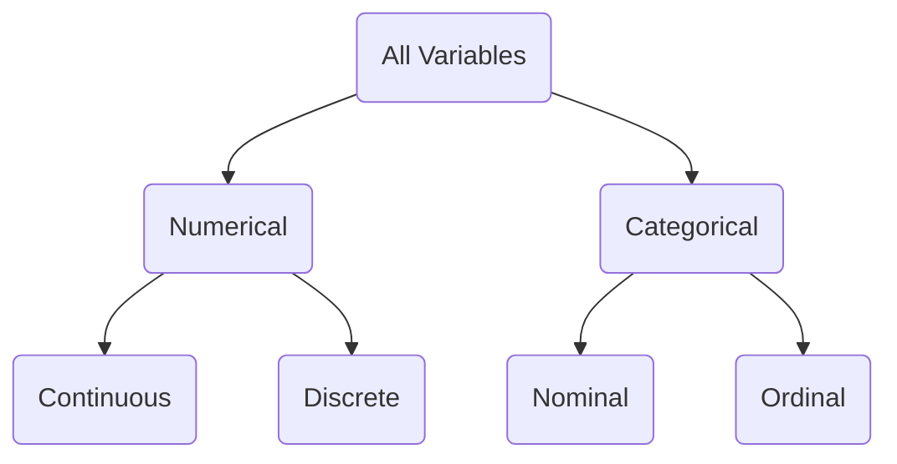

Week 1 - Introduction to Data

**Treatment Group**: Sample of population who received a particular treatment. (e.g. stent)

**Control Group**: Sample of population who **did not** receive a particular treatment. (e.g. Placebo)

**Summary statistic**: a numerical characteristic that describes a sample e.g. average age of a sample of Deakin students

**Data Matrix**: collection of gathered data displayed in a table.

**Case or Observational Unit**: Characteristics of a population or sample grouped together, represened as a row of data in a Data Matrix

**Variable**: a characteristic of a population or sample, represented by the column of a Data Matrix e.g. the age of a student.

**Continuous:** A variable whose values can take a wide range of numerical values, and it is sensible to add, subtract, or take averages with those values.

**Discrete**: A variable whose values can only take whole non-negative numbers

**Nominal**: A variable used to represent a group of unordered categories such as red, blue, white. Their order is not significant.

**Ordinal**: A variable used to represent a group of ordered categories such as education level, or Year Level.

> **The 5Ws**
> **Who**: Describes the individuals or objects surveyed or observed.
> **What**: Determine what exactly is being measured (the variables).
> **When**: When was the research conducted?
> **Where**: Where was the research conducted?
> **Why**: What was the purpose of the survey or experiment?
> **How**: How was the survey or experiment was conducted?

**Population**: a collection of objects, animals or people whose properties are to be investigated
e.g. all students attending Deakin. The goal is to describe the target population, but this is usually impractical or impossible, so a subset is used.

**Sample**: a subset of a population – ideally it is representative of the target population so valid inferences can be made e.g. a random selection of Deakin students

**Explanatory variable**: a variable that is being manipulated by the researcher

**Response variable**: a variable whose values are to be compared between treatment groups

**Experiment**: a planned activity that imposes treatments and results in responses to compare

**Observational study**: no manipulation of variables or assignment to treatments - existing records are used.

**Statistic**: A numerical characteristic that describes a sample.

**Parameter**: a numerical characteristic that describes a population. e.g. average age of all Deakin students

**Data matrix**: structure containing the raw data with a row for each person/case and a column for each variable

