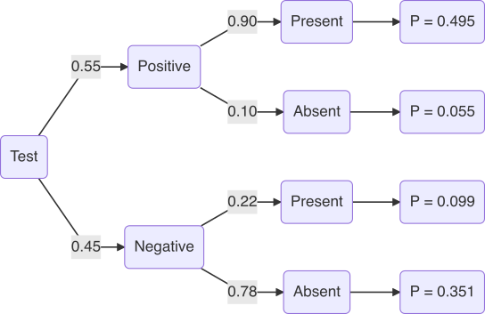

****
```{r echo=FALSE}
library(knitr)
```

**Due: by 8pm Monday September 13th**

**Total marks: 80, Weighting: 20%**

**Question 2.1**

People have one of four blood types – O, A, B or AB and each blood type is further classified as Rh-positive or Rh-negative. For a particular country, the percentages of the population having each blood type are shown below.

```{r echo=FALSE}
rownames <- c("Positive", "Negative")
colnames <- c("O", "A", "B", "AB")

Q2_1 <- matrix(c(38, 34, 9, 3, 7, 6, 2, 1), nrow = 2, byrow = TRUE, dimnames = list(rownames, colnames))
kable(Q2_1)
```

a. For a randomly selected person from this country, what is the probability that their blood type is:
    i. not A positive?
        $$
        \begin{aligned}
            P(A_c^+) &= 1 - 0.34\\
            &=0.66\\
        \end{aligned}
        $$
    ii. B positive or AB?
        $$
        \begin{aligned}
            P(B^+) + P(AB^+) + P(AB^-) &= 0.09 + 0.03 + 0.01\\
            &=0.13\\
        \end{aligned}
        $$
    iii. type O or Rh-positive?
        $$
        \begin{aligned}
            P(O) &= P(O^+) + P(O^-)\\
            &= 0.38 + 0.07\\
            &= 0.45\\
            P(Rh^+) &= P(A^+) + P(B^+) + P(AB^+)\\
            &= 0.34 + 0.09 + 0.03\\
            &= 0.46\\
            P(O) + P(Rh^+) &= 0.45 + 0.46\\
            &= 0.91\\
        \end{aligned}
        $$
b. Among 3 random blood donors, what is the probability (to 4 decimal places) that:
    i. all are Type A?
        $$
        \begin{aligned}
            P(A^-) + P(A^+) &= 0.34 + 0.06\\ 
            P(A)^3 &=0.4^3\\
            &=0.064\\
        \end{aligned}
        $$
    ii. none of them are Rh-negative?
        $$
        \begin{aligned}
            P(Rh^+) &= 0.38 + 0.34 + 0.09 + 0.03\\
            P(Rh^+)^3 &= 0.84^3\\
            &= 0.593\\
        \end{aligned}
        $$
    iii. at least one person is type O positive?
        $$
            \begin{aligned}
                P(O^+) &= 0.38\\
                P(O^+_c) &= 1 - P(O)\\
                &= 1 - 0.38\\
                &= 0.62\\
                P(O^+_c) \times P(O^+_c) \times P(O^+) &= 0.62 \times 0.62 \times 0.38\\
                &= 0.1461\\
            \end{aligned}
        $$
    iv. the third donor only has blood type B?
        $$
            \begin{aligned}
                P(B) &= P(B^+) + P(B^-)\\
                &= 0.09 + 0.02\\
                &= 0.11\\
                P(B_c) &= 1 - P(B)\\
                &= 1 - 0.11\\
                &= 0.89\\
                P(B_c) \times P(B_c) \times P(B) &= 0.89 \times 0.89 \times 0.11\\
                &= 0.0871\\
            \end{aligned}
        $$
        

**Question 2.2**

Most wild freshwater fish carry parasites which usually don’t affect the health of the fish. Due to environmental changes, parasites can increase and result in fungal and tapeworm infections causing visible symptoms on fish.

In fish observed at one location, 15% had fungal infections, 7% had fungal and tapeworm infections and 9% were infected with tapeworm. Let A be the event that a fish has a fungal infection, and let B be the event that a tapeworm infection is present. Using a Venn diagram or otherwise, answer the following:

a) What is the probability that a fish doesn’t show any signs of a fungal or tapeworm infection?
    $$
        \begin{aligned}
            P(A\ or\ B) &= (P(A) + P(B)) - P(A\ and\ B)\\
            &= (0.15 + 0.09) - 0.07\\
            &= 0.017\\
            P(A_c\ and\ B_c) &= 1 - P(A\ or\ B)\\
            &= 1 - 0.17\\
            &= 0.983\\
        \end{aligned}
    $$
b) Calculate $P(A or B)$.
    $$
        \begin{aligned}
            P(A\ or\ B) &= (P(A) + P(B)) - P(A\ and\ B)\\
            &= (0.15 + 0.09) - 0.07\\
            &= 0.017\\
        \end{aligned}
    $$
c) Find $P(B|A)$.
    $$
        \begin{aligned}
            P(B|A) &= \frac{P(A\ and\ B)}{P(A)}\\
            &= \frac{0.07}{0.15}\\
            &= 0.466\\
        \end{aligned}
    $$
d) Are fungal and tapeworm infections independent events? Explain.

_Fungal and tapeworm infections are not independent as it is possible for a fish to have one or the other or both conditions_

**Question 2.3**

Diagnostic tests of medical conditions can be positive or negative whether or not a patient has the condition. A false negative occurs when the test result is negative given that the patient does in fact have the condition. A positive test can indicate that the patient has the condition or is a false positive when the patient does not actually have the condition. Consider a sample of 200 randomly selected patients, some of whom have a medical condition. Results for a new diagnostic test for the condition are shown.

```{r echo=FALSE}
rownames <- c("Positive result", "Negative result", "totals")
colnames <- c("Condition Present", "Condition Absent", "Totals")

Q2_3 <- matrix(c(100, 10, 110, 20, 70, 90, 120, 80, 200), nrow = 3, byrow = TRUE, dimnames = list(rownames, colnames))
kable(Q2_3)
```

What is the probability of a false positive or false negative result? Include any calculations or diagrams used.

_The probability of a false positive and false negative are 0.055 and 0.099 respectively._

{width=75%}

**Question 2.4**

For healthy adults, the main pulmonary artery (MPA) diameter is 2.73 cm, with standard deviation 0.31 cm. Assume MPA diameter is normally distributed.

a) Use the **68-95-99.7% rule** to find the percentage of healthy adults expected to have an MPA diameter between 1.80 cm and 3.04 cm.
    $$
        \begin{aligned}
            34+34+13.5+2.5 = 84\%\\
        \end{aligned}
    $$
b) What proportion of healthy adults have an MPA diameter:
    i.  no greater than 3.15 cm?
        $$
            \begin{aligned}
                z &= \frac{3.15 - 2.73}{0.31}\\
                &= \frac{0.42}{0.31}\\                
                &= 1.35\\
                P &= 0.9115\\
            \end{aligned}
        $$
    ii.  between 2 cm and 3 cm?
        $$
            \begin{aligned}
                z_1 &= \frac{3 - 2.73}{0.31} = 0.871\\
                z_2 &= \frac{2 - 2.73}{0.31} = -2.35\\
                P&= 0.8078 - 0.0096\\
                &= 0.7982\\
            \end{aligned}
        $$
c) What is the cut off length for the largest 20% of diameters? 
    $$
      \begin{aligned}
        z &= \frac{x - \mu}{\sigma}\\
        x &= (z \times \mu) + \sigma\\
        x &+ (0.84 \times 0.31) + 2.73\\
        x &= 2.99cm\\
      \end{aligned}
    $$
d) Give the interquartile range of the MPA diameters.
    $$
      \begin{aligned}
        x_1 &= (0.68 \times 0.31) + 2.73\\
        x_1 &= 2.94\\
        x_2 &= (-0.67 \times 0.31) + 2.73\\
        x_2 &= 2.52\\
      \end{aligned}
    $$
    _The interquartile range is 2.52cm to 2.94cm_

**Question 2.5**

Assume 70% of the adult population are vaccinated for a particular virus.

a.  Amongst 7 randomly selected adults, what is the probability that:
    i. no-one is vaccinated?
    $$
        \begin{aligned}
            {n \choose k}p^kq^{n-k}  &= \frac{n!}{k!(n-k)!}p^kq^{n-k}\\
            &= \frac{7!}{0!(7-0)!}\times 0.7^0\times 0.3^7\\
            &= 1 \times 1 \times 0.0002187\\
            &= 0.0002187\\
        \end{aligned}
    $$
    ii. exactly 3 people are vaccinated?
        $$
            \begin{aligned}
                {n \choose k}p^kq^{n-k} &= \frac{7!}{3!(7-3)!}0.7^30.3^{7-3}\\
                &= \frac{5040}{3!(7-3)!}0.7^3 \times 0.3^4\\
                &= \frac{5040}{144} \times 0.7^3 \times 0.3^4\\
                &= 35 \times 0.343 \times 0.0081\\
                &= 0.0973\\
            \end{aligned}
        $$
    iii. no more than 5 people have been vaccinated?
        $$
            \begin{aligned}
                1 - {n \choose k}p^kq^{n-k} &= 1 - \frac{n!}{k!(n-k)!}p^kq^{n-k}\\
                &= 1 - \frac{7!}{2!(7-2)!}0.7^20.3^{7-2}\\
                &= 1 - \frac{5040}{240} \times 0.7^2 \times 0.3^5\\
                &= 1 - (21 \times 0.49 \times 0.00243)\\
                &= 1 - 0.0250\\
                &= 0.975\\
            \end{aligned}
        $$
    
b.  For 300 randomly selected adults,
    i. how many would you expect to be vaccinated?
    $$
        \begin{aligned}
            \mu =np &= 300 \times 0.7\\
            &= 210\\
        \end{aligned}
    $$
    ii. what is the probability that less than 190 people have been vaccinated?
    $$
        \begin{aligned}
            nq &= 300 \times 0.3\\
            &= 90\\
            np &> 10\\
            nq &> 10\\
            \\
            \sigma &= \sqrt{npq}\\
            &= \sqrt{300 \times 0.7 \times 0.3}\\
            &= 7.937\\
            \\
            P(x < 190) &= P(z < \frac{190-210}{7.937})\\
            &= P(z < -2.520)\\
            &= 0.0059\\
        \end{aligned}
    $$
    
**Question 2.6**
Platelet rich plasma (PRP) therapy is used to accelerate the healing of injured tendons, ligaments and joints, using plasma derived from the patient’s own blood. A study involving 255 randomly selected patients with shoulder pain caused by rotator cuff tears reported that after receiving a PRP injection, 225 patients experienced at least a 50% reduction in pain.

Is there evidence that PRP therapy relieves pain in more than 85% of patients with such shoulder pain?

a. Write appropriate hypotheses.
    $$
        \begin{aligned}
            H_0: p = 0.85\\
            H_A: p > 0.85\\
        \end{aligned}
    $$
    
b. Check the assumptions and conditions.
    1. _The question has confirmed that the sample has been gathered randomly_
    2. _The sample gathered is < 10% of the population (N)_
    3. _np > 10 and nq > 10_
    
    $$
        \begin{aligned}
            np &\geq 10:\ = 255 \times 0.88 = 224\\ 
            nq &\leq 10:\ = 255 \times 0.15 = 31
        \end{aligned}
    $$

c. Calculate the test statistic and find the P-value.
$$
    \begin{aligned}
        z &= \frac{\hat{p}-{p_0}}{\sqrt{\frac{p_0q_0}{n}}}\\
        &= \frac{0.88-0.85}{\sqrt{\frac{0.85 \times 0.15}{255}}}\\
        &= \frac{0.03}{0.0223}\\
        &= 1.35\\
        \\
        p &= 0.9115
    \end{aligned}
$$

d. State your conclusion in plain English. Use a significance level of 5%.
_The z statistic and P-value in this example suggest that there is a probability of 91.15% that our sample data agrees with our alternative hypothesis._

e. Calculate a 90% confidence interval for the true proportion of patients with shoulder pain caused by rotator cuff tears whose pain is reduced by the PRP therapy, and interpret your interval in context.
$$
    \begin{aligned}
        confindence\ interval\ = \hat{p} &\pm 1.65 \times \sqrt{{\frac{0.88 \times 0.12}{255}}}\\
        &= 0.88 \pm 1.65 \times 0.020\\
        &= 0.88 - 0.020\ to\ 0.88 + 0.020\\
        &= 0.86\ to\ 0.9\\
        &= 86\%\ to\ 90\%
    \end{aligned}
$$

f. Explain how the confidence interval supports your conclusion from part d).
_The confidence interval of 86% to 90% supports the alternate hypothesis that greater than 85% of participants will report at least a 50% reduction in pain after the surgery. Our sample for this exercise is within this proportion range._

**Question 2.7**

A clinical trial for a potential new drug to treat attention deficit hyperactivity disorder (ADHD) was performed. While the drug appeared to reduce the symptoms of ADHD, there was concern over possible side effects. Researchers reported that 85 of the 374 patients who took the drug experienced side effects, compared to 65 of the 210 subjects who were given a placebo. Patients didn’t know which treatment they were given. Is there evidence of a significant difference between the treatment groups for the proportions of subjects who experience side effects?

a.  Write appropriate hypotheses.
  $$
    \begin{aligned}
      H_0: p_1 = p_2\\
      H_a: p_1 \neq p_2\\
    \end{aligned}
  $$
b.  Calculate the test statistic, find the P-value and state your conclusion in plain English. Use $\alpha = 0.05$.
  $$
    \begin{aligned}
      \hat{p}_{pooled} &= \frac{85 + 65}{374+210} = \frac{150}{584} = 0.2568\\
      z &= \frac{\hat{p_1}-{\hat{p_2}}}{\sqrt{\frac{p_{pooled} \times q_{pooled}}{n_1} - \frac{p_{pooled} \times q_{pooled}}{n_2}}}\\
      &= \frac{0.23-0.31}{\sqrt{\frac{0.2568 \times 0.7432}{374} + \frac{0.2568 \times 0.7432}{210}}}\\
      &= \frac{-0.08}{0.0377}\\
      &= -2.12\\
      \\
      P-value &= 0.170\\
    \end{aligned}
  $$

    _The P-value is > $\alpha = 0.05$, suggesting that there is no evidence that the measurement of side effects relating to this study, cannot be attributed to the drug             conclusively. This may suggest that the dose of the drug was incorrect, or that it has no effect._

c.  Create a 95% confidence interval for the difference in the proportions of side effects, and interpret your interval in context.
  $$
    \begin{aligned}
      \hat{p}_1 &= \frac{85}{374} = 0.23\\
      \hat{p}_2 &= \frac{65}{210} = 0.31\\
      (\hat{p}_1 - \hat{p}_2) \pm z^* \times SE &= (\hat{p}_1 - \hat{p}_2) \pm z^* \times \sqrt{\frac{\hat{p}_1\hat{q}_1}{n_1}+\frac{\hat{p}_1\hat{q}_1}{n_2}}\\
      &= (0.23 - 0.31) \pm 1.96 \times \sqrt{\frac{0.23 \times 0.77}{374}+\frac{0.31 \times 0.69}{210}}\\
      &= -0.08 \pm 0.0757\\
      &= -0.1557103\ to\ -0.00428969\\
    \end{aligned}
  $$
  _The negative range confirms with 95% certainty that there is a significant difference between the drug results and those of the placebo._
d.  Did you expect 0 to be in your confidence interval? Explain briefly.
  _Yes...Having a confidence interval containing 0 suggests that if the same trial were to be replicated, the results would not match those of this trial. The initial results from the test group and control group hinted that the drug being tested either has very few side effects, or does not work in comparison to the placebo. _

**Question 2.8**

The council of a regional town conducted a survey to determine how their workers usually travel to work. The study found that 68% of workers travelled using their cars, 17% used public transport, 11% rode bicycles and 4% walked. A local large employer ran a similar survey at her workplace, with 150 responses recorded. Below are the observed counts for each method of transportation used by the sampled workers:

```{r echo=FALSE}
rownames <- c("Observed Count")
colnames <- c("Car", "Public Transport", "Bicycle", "Walk")

Q2_8 <- matrix(c(98, 29, 20, 3), nrow = 1, byrow = TRUE, dimnames = list(rownames, colnames))
kable(Q2_8)
```

a.  If the sampled workers’ transportation methods match the findings of the council’s survey, what are the expected numbers for each method of transport?
b.  State your hypotheses for the appropriate test.
c.  Calculate the test statistic value.
d.  State the degrees of freedom and P-value.
e.  Give your conclusion (use $\alpha$ = 0.05) in the context of the question.

**Question 2.9**

Alcohol consumption patterns were recorded for a random sample of 180 university students to explore a possible relationship between gender and alcohol consumption, with the results shown below.

```{r echo=FALSE}
rownames <- c("Female", "Male")
colnames <- c("At Least Weekly", "Less Than Weekly", "None")

Q2_9 <- matrix(c(38, 24, 24, 57, 22, 15), nrow = 2, byrow = TRUE, dimnames = list(rownames, colnames))
kable(Q2_9)
```

Carry out the appropriate hypothesis test and include all the steps (including checking the assumptions and conditions). Use a significance level of 10%.